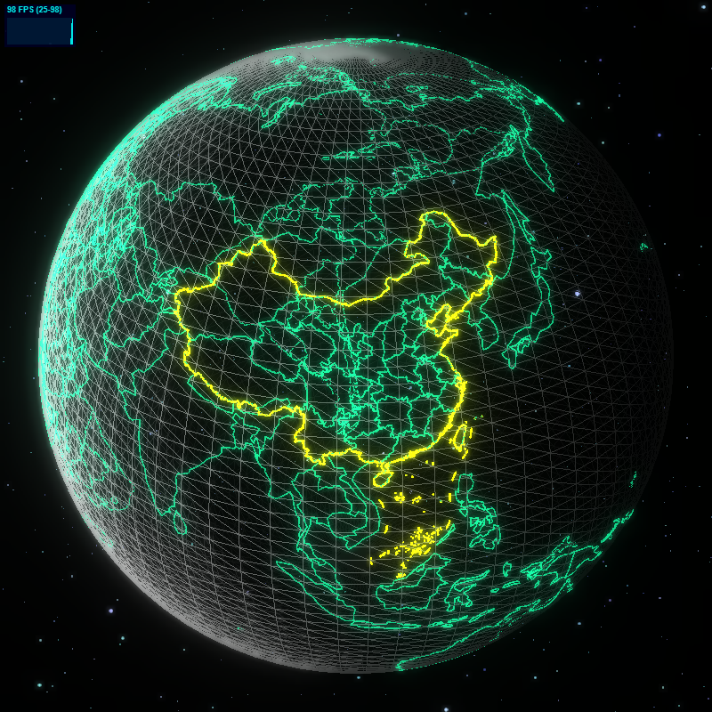

<p align="center">
  <a >
    
  </a>
  <a >
    
  </a>
  <a >
    
  </a>
  <br>
</p>

<h1 align="center">ThreeJs 3D Earth</h1>

<p align="center">Vue3 3D Earth</p>

<p style="text-align:center;">
  <a></a>
  <a></a>
  <a></a>
  <a></a>
  <a></a>
  <a></a>
  <a></a>
  <a></a>
</p>

This is a library for implementing 3D earth based on ThreeJs, suitable for Vue3, which contains earth textures, muddy light, animation, background, halo, starry sky, clouds, light source, geojson, map border, beam of light, scatter, flight line etc.

Note: The size of the package itself is not large, mainly caused by geojson and base64, but don't worry, it will not go to jia'zai if it is not used

## Installing

```shell
# three install
pnpm add three@0.135.0

# npm
npm install three-earth
# yarn
yarn add three-earth
# pnpm
pnpm add three-earth
```

## Quick Start

```html
<script lang="ts" setup>
import { ThEarth } from 'three-earth'
</script>
<template>
  <th-earth style="height: 300px;" />
</template>
```

## Documentation

- [Earth Documentation](/docs/earth.md)
- [Earth Border Documentation](/docs/earth-border.md)
- [Earth Line Documentation](/docs/earth-line.md)
- [Earth Beam Documentation](/docs/earth-beam.md)

**Examples**
- [Examples Documentation](/docs/example.md)

## Import separately
If you only want to import the components you `need`, you can use the on-demand import method.

```javascript
// main.ts
import App from './App.vue'
import { createApp } from 'vue'
import { ThEarth, ThEarthBorder, ThEarthLine, ThEarthBeam } from 'three-earth'

...
```

